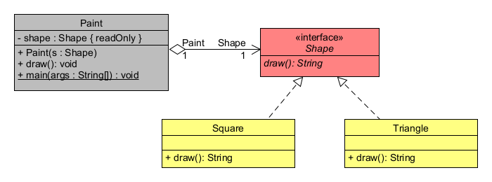
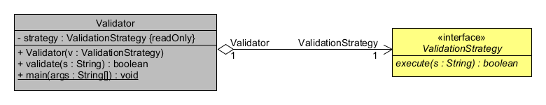
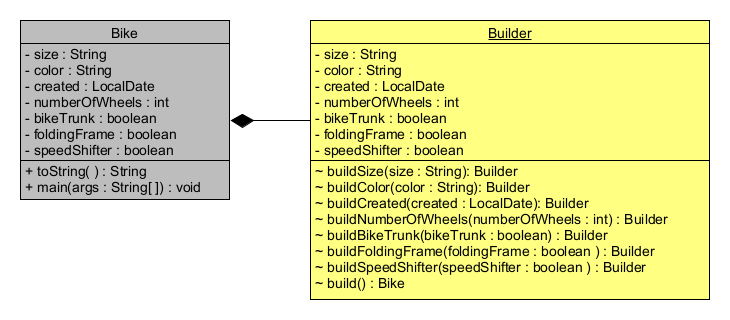
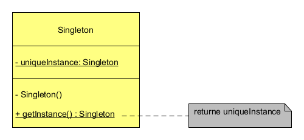

## Design Patterns via Java

### The project contains design patterns (templates) via Java.

***Repository content:***

***Click on the icon***

***in the text below and get a picture with a UML class diagram.***

<strong>&#128194; BehavioralPatterns </strong>

<!-- TABLE OF CONTENTS -->

  
chainOfResponsibility

  <ol>

  </ol>

<!-- TABLE OF CONTENTS -->

  
chainOfResponsibility1 (with lambda)

  <ol>
without UML diagram
  </ol>

<!-- TABLE OF CONTENTS -->

  
chainOfResponsibility2

  <ol>

  </ol>

<!-- TABLE OF CONTENTS -->

  
iterator

  <ol>
without UML diagram
  </ol>

<!-- TABLE OF CONTENTS -->

  
observer

  <ol>

  </ol>

<!-- TABLE OF CONTENTS -->

  
observer1 (with lambda)

  <ol>

  </ol>

<!-- TABLE OF CONTENTS -->

  
strategy

  <ol>

  </ol>

<!-- TABLE OF CONTENTS -->

  
strategy1 (with lambda)

  <ol>

  </ol>

<strong>&#128194; CreationalPatterns </strong>

<!-- TABLE OF CONTENTS -->

  
builder

  <ol>

  </ol>

<!-- TABLE OF CONTENTS -->

  
singleton

  <ol>

  </ol>

<!-- TABLE OF CONTENTS -->

  
factory

  <ol>

  </ol>

<!-- TABLE OF CONTENTS -->

  
factory1 (with lambda)

  <ol>

  </ol>

<strong>&#128194; StructuralPatterns </strong>

<!-- TABLE OF CONTENTS -->

  
adapter

  <ol>

  </ol>

<!-- TABLE OF CONTENTS -->

  
decorator

  <ol>

  </ol>

<!-- TABLE OF CONTENTS -->

  
facade

  <ol>

  </ol>

(<a href="#readme-top">back to top</a>)
